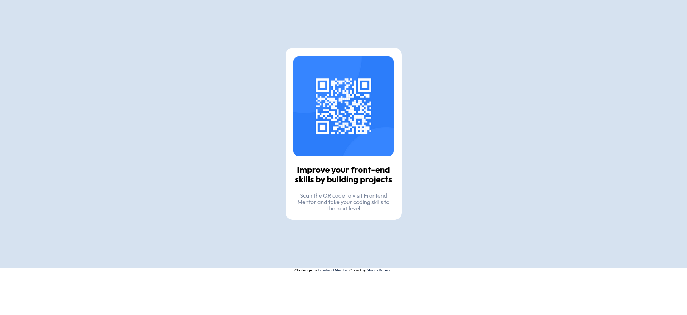

# Frontend Mentor - QR code component solution

This is a solution to the [QR code component challenge on Frontend Mentor](https://www.frontendmentor.io/challenges/qr-code-component-iux_sIO_H). Frontend Mentor challenges help you improve your coding skills by building realistic projects.

## Table of contents

-   [Overview](#overview)
    -   [Screenshot](#screenshot)
    -   [Links](#links)
-   [My process](#my-process)
    -   [Built with](#built-with)
    -   [What I learned](#what-i-learned)
    -   [Continued development](#continued-development)
    -   [Useful resources](#useful-resources)
-   [Author](#author)
-   [Acknowledgments](#acknowledgments)

## Overview

### Screenshot

### Links

-   Solution URL: [GitHub](https://github.com/baremarco/qr-code-component-main)
-   Live Site URL: [GitHup Pages](https://baremarco.github.io/qr-code-component-main/)

## My process

### Built with

-   Semantic HTML5 markup
-   SASS
-   Flexbox

### What I learned

-   Learned **Sass**
-   Learned **css flexbox**
-   Learned about **markdown** syntax

### Continued development

-   Keep using sass and the **7-1 architecture**
-   Improve css flexbox and css grid

### Useful resources

-   [resource 1](https://www.youtube.com/watch?v=CR-a8upNjJ0&t=2s&ab_channel=KevinPowell) - This helped me for replace the deprecate import and how to use **@use** and **@forward**. I really liked this pattern and will use it going forward.
-   [resource 2](https://sass-guidelin.es/#architecture) - This is an amazing article which helped me understand **7-1 architecture**. I'd recommend it to anyone still learning this concept.

-   [resource 3](https://www.markdownguide.org/basic-syntax/) - This helped me for learn markdown syntax

## Author

-   Frontend Mentor - [@baremarco](https://www.frontendmentor.io/profile/baremarco)
-   Twitter - [@baremarco](https://www.twitter.com/baremarco)

## Acknowledgments

-   Thanks to Kevin Powell and his youtube [channel](https://www.youtube.com/channel/UCJZv4d5rbIKd4QHMPkcABCw)
-   Thanks to the frontend mentor [Slack community](https://www.frontendmentor.io/slack).
